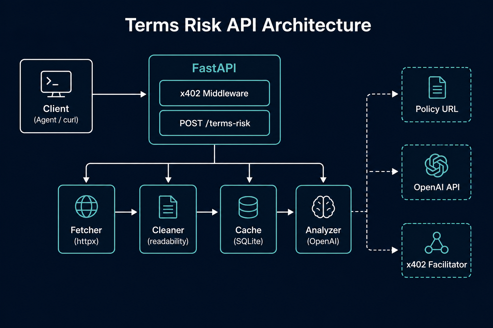
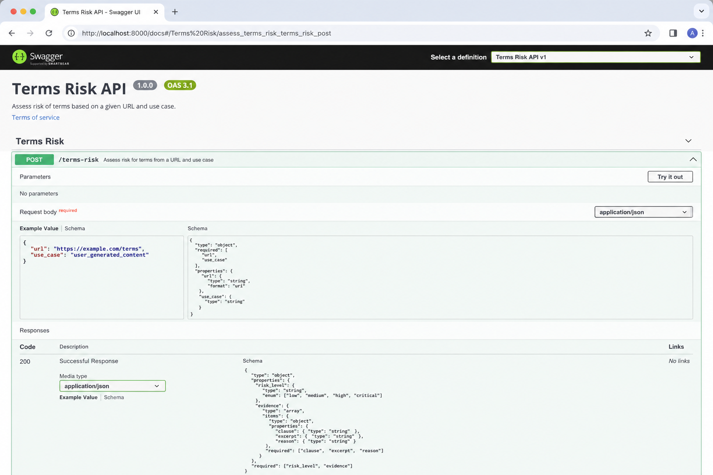
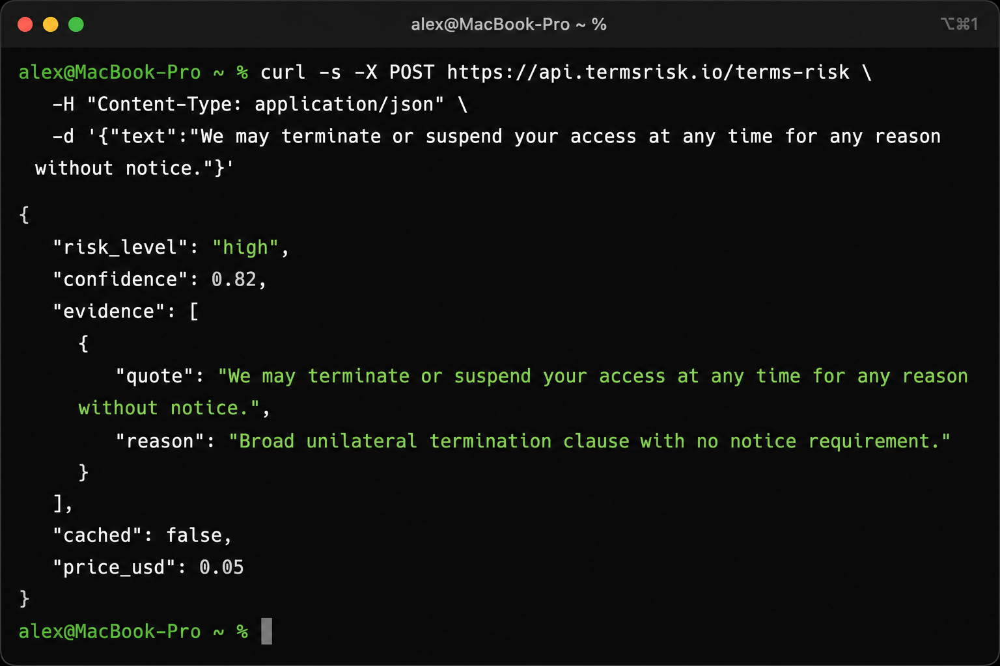

# Terms Risk API

A production-ready FastAPI service that analyzes Terms of Service, Privacy Policy, and license pages against a specific use case — returning structured JSON with evidence quotes, cache metadata, and x402 payment support.

**Not legal advice.** Automated policy analysis only.

[](https://www.python.org/downloads/)
[](https://fastapi.tiangolo.com/)
[](https://x402scan.com/discovery/spec)

---

## Screenshots

### Architecture



### Interactive API docs (`/docs`)



### Example response



---

## Quick start

```bash
git clone https://github.com/ruti3/terms-risk-api.git
cd terms-risk-api
python3 -m venv .venv && source .venv/bin/activate
pip install -r requirements.txt
cp .env.example .env   # set OPENAI_API_KEY
uvicorn app.main:app --reload --port 8000
```

```bash
curl -s -X POST http://localhost:8000/terms-risk \
  -H "Content-Type: application/json" \
  -d @docs/examples/request.json | jq
```

| Endpoint | Description |
|----------|-------------|
| `POST /terms-risk` | Analyze a policy URL |
| `GET /docs` | Swagger UI |
| `GET /openapi.json` | OpenAPI discovery (x402scan) |
| `GET /llms.txt` | LLM agent discovery |
| `GET /health` | Liveness probe |

---

## JSON examples

### Request

```json
{
  "url": "https://www.cloudflare.com/website-terms/",
  "use_case": "Can I scrape and commercially reuse public listings?"
}
```

See [`docs/examples/request.json`](docs/examples/request.json).

### Fresh response (`$0.03`)

```json
{
  "risk_level": "high",
  "scraping_allowed": false,
  "commercial_use_allowed": false,
  "confidence": 0.82,
  "summary": "The terms likely restrict automated access and commercial reuse.",
  "evidence": [
    {
      "quote": "You may not access or collect data from our services using automated means.",
      "reason": "Directly restricts scraping."
    }
  ],
  "cached": false,
  "price_usd": 0.03
}
```

Full example: [`docs/examples/response-fresh.json`](docs/examples/response-fresh.json)

### Cached response (`$0.01`)

Same fields, with `"cached": true`, `"cache_age_days": 3`, `"price_usd": 0.01`.

See [`docs/examples/response-cached.json`](docs/examples/response-cached.json)

### Errors

| Status | Example |
|--------|---------|
| 400 | [`docs/examples/error-400.json`](docs/examples/error-400.json) |
| 402 | [`docs/examples/error-402.json`](docs/examples/error-402.json) |

---

## Architecture

```
Client → x402 middleware → POST /terms-risk
                              ↓
                    fetcher → cleaner → cache?
                              ↓ miss
                         analyzer (OpenAI)
                              ↓
                         SQLite cache → JSON response
```

Full diagrams and module map: [`docs/ARCHITECTURE.md`](docs/ARCHITECTURE.md)

| Module | Role |
|--------|------|
| `fetcher.py` | HTTP fetch, 15s timeout, error types |
| `cleaner.py` | HTML → text (readability-lxml) |
| `analyzer.py` | OpenAI structured output |
| `cache.py` | SQLite cache (url + use_case + content hash) |
| `discovery.py` | OpenAPI + x402scan metadata |
| `x402_config.py` | Payment middleware |

---

## Benchmark

Run locally:

```bash
python scripts/benchmark.py
python scripts/benchmark.py --fresh   # includes OpenAI call
```

Latest results (in-process TestClient, local run):

| Endpoint | p50 | p95 | mean |
|----------|-----|-----|------|
| `GET /health` | 0.56 ms | 0.94 ms | 0.63 ms |
| `POST /terms-risk` (cache hit) | 341 ms | 980 ms | 396 ms |
| `POST /terms-risk` (fresh) | 624 ms | 7.2 s | 2.7 s |

Cache hits still re-fetch the origin URL to validate content hash. Fresh analysis is dominated by HTTP fetch + OpenAI latency.

Full report: [`docs/benchmark.md`](docs/benchmark.md)

---

## Pricing

| Scenario | Price | When |
|----------|-------|------|
| Fresh analysis | **$0.03** | First request for url+use_case, or page changed |
| Cache hit | **$0.01** | Repeat request, same content hash |

Payment via [x402](https://x402.org) when `X402_ENABLED=true`. Discoverable on [x402scan](https://www.x402scan.com/resources/register).

### x402 setup (CDP wallet + probe)

```bash
# Seller: create receiver wallet → set X402_PAY_TO in .env → restart API
npm run wallet:create

# Verify unpaid requests return 402
npm run x402:probe

# Buyer: fund testnet wallet (ETH + USDC on Base Sepolia)
npm run wallet:fund

# Buyer: pay $0.03 and call POST /terms-risk (full end-to-end)
npm run x402:pay
```

`probe-x402` expects **402** — if you get **400**, the handler ran (payment gate off or server not restarted).

Buyer docs: [CDP x402 Quickstart for Buyers](https://docs.cdp.coinbase.com/x402/quickstart-for-buyers)

**CDP facilitator (testnet or mainnet):** set `X402_FACILITATOR_URL=https://api.cdp.coinbase.com/platform/v2/x402` plus `CDP_API_KEY_ID` / `CDP_API_KEY_SECRET`. The server signs Ed25519 JWTs automatically via `cdp-sdk`.

**Dynamic pricing:** x402 charges **$0.01** when `url`+`use_case` already exists in the SQLite cache, otherwise **$0.03**. No `X402_PRICE` env var.

---

## Deployment

### Docker

```bash
docker build -t terms-risk-api .
docker run -p 8080:8080 --env-file .env -v $(pwd)/data:/app/data terms-risk-api
```

Container listens on **8080** (matches `fly.toml` `internal_port`).

### Render

1. New **Web Service** → connect repo
2. **Build:** `pip install -r requirements.txt`
3. **Start:** `uvicorn app.main:app --host 0.0.0.0 --port $PORT`
4. **Env:** `OPENAI_API_KEY`, `PUBLIC_BASE_URL=https://your-app.onrender.com`
5. Add disk for `data/` (cache persistence)

### Railway

```bash
railway init
railway variables set OPENAI_API_KEY=sk-...
railway up
```

Set start command: `uvicorn app.main:app --host 0.0.0.0 --port $PORT`

### Fly.io

Config is in [`fly.toml`](fly.toml) (`internal_port = 8080`).

```bash
fly secrets set OPENAI_API_KEY=sk-...
fly deploy
```

Mount a volume at `/app/data` for SQLite cache. Set `PUBLIC_BASE_URL` to your Fly HTTPS URL.

GitHub auto-deploy is configured via [`.github/workflows/fly-deploy.yml`](.github/workflows/fly-deploy.yml). Set the repo secret `FLY_API_TOKEN`, then every push to `main` will run `flyctl deploy --remote-only`.

### Production checklist

- [ ] Set `OPENAI_API_KEY`
- [ ] Set `PUBLIC_BASE_URL` to your public HTTPS origin
- [ ] Enable x402: `X402_ENABLED=true`, `X402_PAY_TO=0x...`
- [ ] **Testnet:** `eip155:84532` + `https://x402.org/facilitator` (no CDP auth)
- [ ] **Mainnet / CDP facilitator:** `eip155:8453` + `X402_FACILITATOR_URL=https://api.cdp.coinbase.com/platform/v2/x402` + `CDP_API_KEY_ID` / `CDP_API_KEY_SECRET`
- [ ] Pricing is dynamic ($0.01 cached url+use_case, $0.03 fresh) — no `X402_PRICE` env needed
- [ ] Persist `data/` volume across deploys
- [ ] Validate discovery: `npx -y @agentcash/discovery yourdomain.com -v`

---

## Environment variables

| Variable | Default | Description |
|----------|---------|-------------|
| `OPENAI_API_KEY` | — | Required for analysis |
| `OPENAI_MODEL` | `gpt-4o-mini` | Model for structured output |
| `X402_ENABLED` | `false` | Enable payment gate |
| `X402_SKIP_PAYMENT` | `true` | Bypass payment (local dev) |
| `X402_PAY_TO` | — | Wallet address |
| `X402_NETWORK` | `eip155:84532` | Payment network (CAIP-2) |
| `X402_FACILITATOR_URL` | `https://x402.org/facilitator` | Testnet facilitator (no auth). Use `https://api.cdp.coinbase.com/platform/v2/x402` for CDP |
| `CDP_API_KEY_ID` / `CDP_API_KEY_SECRET` | — | Required when using CDP facilitator (also `cdp_api_key.json`) |
| `PUBLIC_BASE_URL` | — | Canonical URL for discovery docs |
| `CACHE_DB_PATH` | `data/cache.sqlite` | SQLite cache path |

See [`.env.example`](.env.example) for all options.

---

## For AI agents

Machine-readable discovery:

- [`llms.txt`](llms.txt) — served at `GET /llms.txt`
- [`GET /openapi.json`](http://localhost:8000/openapi.json) — x402scan OpenAPI discovery
- [`GET /.well-known/x402`](http://localhost:8000/.well-known/x402) — x402 resource fan-out

---

## Project structure

```
terms-risk-api/
├── app/
│   ├── main.py                 # FastAPI routes
│   ├── fetcher.py              # HTTP fetch
│   ├── cleaner.py              # HTML cleaning
│   ├── analyzer.py             # OpenAI analysis
│   ├── cache.py                # SQLite cache
│   ├── pricing.py              # Cache vs fresh price tiers
│   ├── pricing_middleware.py   # Sets x402 pricing context
│   ├── cdp_credentials.py      # CDP API key loading
│   ├── discovery.py            # x402scan OpenAPI
│   └── x402_config.py          # Payment middleware (+ CDP facilitator)
├── scripts/
│   ├── create-receiver-wallet.mjs
│   ├── fund-buyer-wallet.mjs
│   ├── pay-terms-risk.mjs
│   ├── probe-x402.mjs
│   └── benchmark.py
├── docs/
│   ├── ARCHITECTURE.md
│   ├── benchmark.md
│   ├── examples/
│   └── screenshots/
├── fly.toml
├── Dockerfile
├── llms.txt
└── requirements.txt
```

---

## License

MIT
