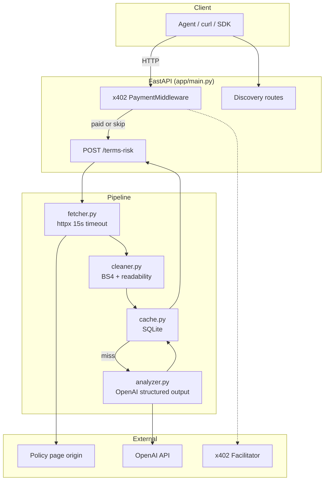
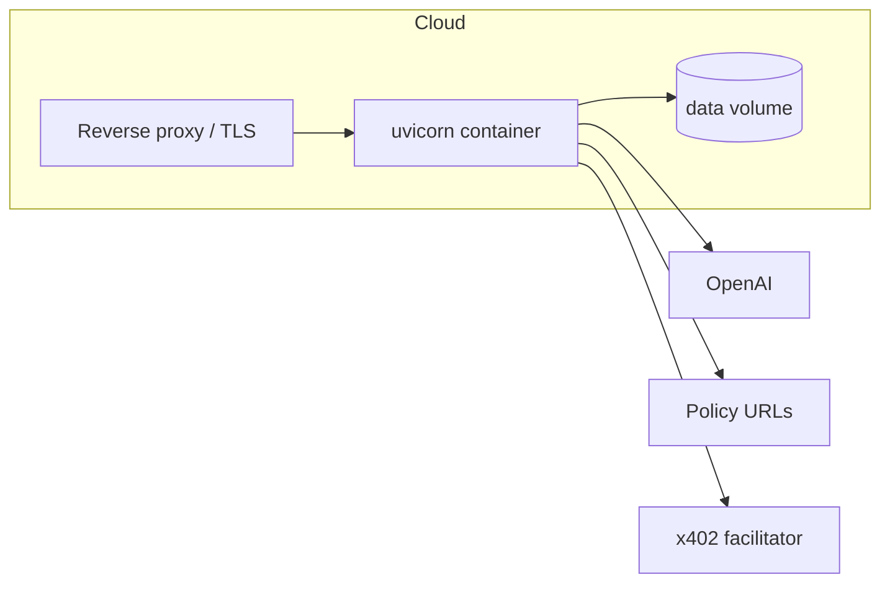

# Architecture

## Overview

Terms Risk API is a single-process FastAPI service that fetches policy pages, extracts readable text, analyzes them with OpenAI structured output, and caches results in SQLite. Optional x402 middleware gates paid access.

## Request flow (fresh analysis)

1. **Payment gate** — `PaymentMiddlewareASGI` returns `402` if x402 enabled and unpaid.
2. **Fetch** — `fetch_url()` follows redirects, validates HTML, 15s timeout.
3. **Clean** — `clean_html()` strips boilerplate via readability-lxml.
4. **Cache lookup** — Key: `url` + `use_case` + content hash.
5. **Analyze** — On miss, OpenAI `responses.parse()` → `AnalysisResult`.
6. **Store** — SQLite cache; attach metadata (`cached`, `price_usd`, `generated_at`).
7. **Log** — JSONL to `data/logs/requests-YYYY-MM-DD.jsonl`.

## Module map

| Module | Responsibility |
|--------|----------------|
| `main.py` | Routes, lifecycle, error mapping |
| `fetcher.py` | HTTP fetch, `FetchError` types |
| `cleaner.py` | HTML → plain text, content hash |
| `analyzer.py` | OpenAI structured risk analysis |
| `cache.py` | SQLite get/set, invalidation on hash change |
| `discovery.py` | OpenAPI + x402scan metadata |
| `x402_config.py` | x402 SDK middleware, Bazaar extension |
| `models.py` | Pydantic request/response schemas |
| `pricing.py` | `CACHED_PRICE_USD`, `FRESH_PRICE_USD` |
| `logger.py` | Request JSONL logging |

## Discovery surfaces

| Path | Consumer |
|------|----------|
| `/openapi.json` | x402scan, AgentCash, OpenAPI clients |
| `/.well-known/x402` | x402 compatibility fan-out |
| `/llms.txt` | LLM agent discovery |
| `/docs` | Swagger UI |

## Data stores

- **SQLite** (`data/cache.sqlite`) — analysis cache keyed by url + use_case + content hash
- **JSONL logs** (`data/logs/`) — per-request latency, cache hit, errors

## Deployment topology

Single container is sufficient for MVP. Mount `data/` for cache persistence across deploys.
